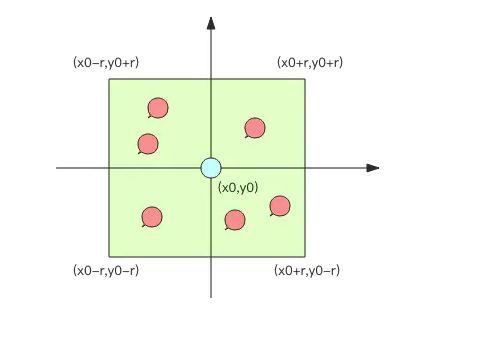

Redis地理位置模块GeoHash可以实现共享单车 美团 饿了么的附近人功能

### 用数据库来算附近的人

地图中的元素使用二维的经纬度表示

- 经度范围（-180，180）东正西负
- 维度范围（-90，90）北正南负

使用关系数据库 (元素 id, 经度 x, 纬度 y) 存储，不能通过遍历所有数据进行排序，数据量大 性能无法满足

通过矩形区域限定元素的数量



指定半径进行筛选

```
select id from positions where x0-r < x < x0+r and y0-r < y < y0+r
```

是用数据库无法应对高并发的查询


### GeoHash 算法

地理位置距离排序算法

将二位的经纬度数据映射到一维的整数，所有的元素挂载到一条线上

查找附近的人，首先将目标位置映射到这条线上，然后在一维的线上获取附近的点

#### 映射算法实现原理

将整个地球看成一个二维平面，之后划分成一系列的方格


业界比较通用的地理位置距离排序算法是 GeoHash 算法，Redis 也使用 GeoHash 算法。GeoHash 算法将二维的经纬度数据映射到一维的整数，这样所有的元素都将在挂载到一条线上，距离靠近的二维坐标映射到一维后的点之间距离也会很接近。

当我们想要计算「附近的人时」，首先将目标位置映射到这条线上，然后在这个一维的线上获取附近的点就行了。那这个映射算法具体是怎样的呢？它将整个地球看成一个二维平面，然后划分成了一系列正方形的方格，就好比围棋棋盘。所有的地图元素坐标都将放置于唯一的方格中。方格越小，坐标越精确。然后对这些方格进行整数编码，越是靠近的方格编码越是接近。那如何编码呢？一个最简单的方案就是切蛋糕法。设想一个正方形的蛋糕摆在你面前，二刀下去均分分成四块小正方形，这四个小正方形可以分别标记为 00,01,10,11 四个二进制整数。然后对每一个小正方形继续用二刀法切割一下，这时每个小小正方形就可以使用 4bit 的二进制整数予以表示。然后继续切下去，正方形就会越来越小，二进制整数也会越来越长，精确度就会越来越高。 