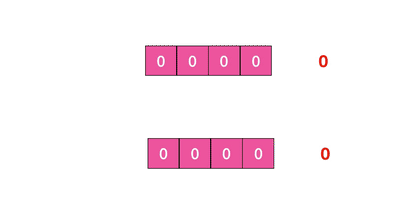

### scan特点

- 复杂度O（n）通过游标分步进行的，不会阻塞线程;

- 提供 limit 参数，可以控制每次返回结果的最大条数，limit 只是一个 hint，返回的 结果可多可少;

- 同 keys 一样，它也提供模式匹配功能

- 服务器不需要为游标保存状态，游标的唯一状态就是 scan 返回给客户端的游标整数

- 返回的结果可能会有重复，需要客户端去重复，这点非常重要

- 遍历的过程中如果有数据修改，改动后的数据能不能遍历到是不确定的

- 单次返回的结果是空的并不意味着遍历结束，而要看返回的游标值是否为零

  

### 字典结构

redis中的key都存储在一个很大的字典中，数组+二维链表结构

- 第一维数组大小2^ n

- 扩容数组大小空间加倍

  


- scan 返回的游标是一维数组的位置索引，该位置索引称为槽slot
- 不考虑字段扩容 缩容， 直接遍历数组的下标即可，limit代表的是需要遍历的槽位数
- 由于有个槽上有的挂载链表，有的没有，所以返回结果有多有少
- 有多个链表，会把链表傻姑娘的元素模式匹配后一次性返回给客户端

### scan遍历顺序

scan不是从第一纬数组的第0位遍历到结尾，采用高位进位加法遍历

主要是考虑字典的扩容 缩容导致遍历的重复和遗漏

- 高位进位从左边加 进位向右边移动
- 和普通加法相反



### 字典扩容


### 大key扫描

- 有大key redis  内存大起大落 
- 大的hash zset 对redis集群环境
  - 迁移会卡顿
  - 扩容会申请大的内存同样卡顿
  - 删除key内存一次性回收 出现卡顿

#### 使用redis-cli查询大key

- -i 0.1 每隔100条scan指令就会休眠0.1s ,ops不会剧烈抬升 扫描时间会变长

```
  ~ redis-cli -p 6380 --bigkeys -i 0.1

# Scanning the entire keyspace to find biggest keys as well as
# average sizes per key type.  You can use -i 0.1 to sleep 0.1 sec
# per 100 SCAN commands (not usually needed).

[00.00%] Biggest string found so far 'abcd' with 8 bytes

-------- summary -------

Sampled 3 keys in the keyspace!
Total key length in bytes is 16 (avg len 5.33)

Biggest string found 'abcd' has 8 bytes

3 strings with 21 bytes (100.00% of keys, avg size 7.00)
0 lists with 0 items (00.00% of keys, avg size 0.00)
0 sets with 0 members (00.00% of keys, avg size 0.00)
0 hashs with 0 fields (00.00% of keys, avg size 0.00)
0 zsets with 0 members (00.00% of keys, avg size 0.00)
0 streams with 0 entries (00.00% of keys, avg size 0.00)
```

