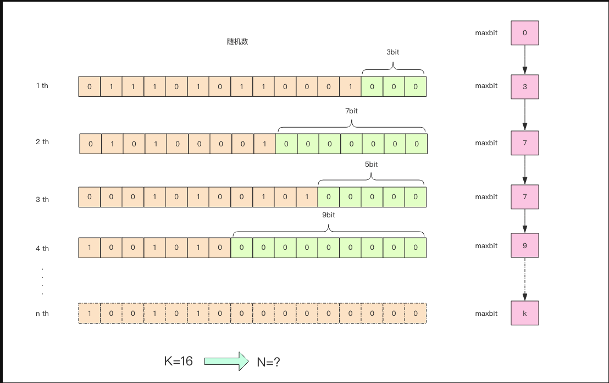
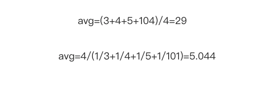

# HyperLogLog


一个常见的业务问题：如果你负责开发维护一个大型的网站,产品经理要网站每个网页每天的 UV 数据，然后让你来开发这个统计模块，你会如何实现？

如果统计 PV 那非常好办，给每个网页一个独立的 Redis 计数器就可以了，这个计数器的 key 后缀加上当天的日期。这样来一个请求，incrby 一次，最终就可以统计出所有的 PV 数据

但是 UV 不一样，它要去重，同一个用户一天之内的多次访问请求只能计数一次。这就要求每一个网页请求都需要带上用户的 ID，无论是登陆用户还是未登陆用户都需要一个唯一 ID 来标识。

你也许已经想到了一个简单的方案，那就是为每一个页面一个独立的 set 集合来存储所有当天访问过此页面的用户 ID。当一个请求过来时，我们使用 sadd 将用户 ID 塞进去就可以了。通过 scard 可以取出这个集合的大小，这个数字就是这个页面的 UV 数据。没错，这是一个非常简单的方案。

​    但是，如果你的页面访问量非常大，比如一个爆款页面几千万的 UV，你需要一个很大的 set 集合来统计，这就非常浪费空间。如果这样的页面很多，那所需要的存储空间是惊人的。为这样一个去重功能就耗费这样多的存储空间，值得么？其实老板需要的数据又不需要太精确，105w 和 106w 这两个数字对于老板们来说并没有多大区别，So，有没有更好的解决方案呢？

​    这就是本节要引入的一个解决方案，Redis 提供了 HyperLogLog 数据结构就是用来解决这种统计问题的。HyperLogLog 提供不精确的去重计数方案，虽然不精确但是也不是非常不精确，标准误差是 0.81%，这样的精确度已经可以满足上面的 UV 统计需求了。

## HyperLogLog使用方法

- pfadd	

- pfcount

使用python构造数据

```
for i in range(100000):
    r.pfadd("code1", "user%d" % i)
    total = r.pfcount("code1")
print(total, i+1)

```


 差了 277 个，按百分比是 0.277%，对于上面的 UV 统计需求来说，误差率也不算高。然后我们把上面的脚本再跑一边，也就相当于将数据重复加入一边，查看输出，可以发现，pfcount 的结果没有任何改变，还是 99723，说明它确实具备去重功能。

##  pfadd 这个 pf 是什么意思

是 HyperLogLog 这个数据结构的发明人 Philippe Flajolet 的首字母缩写，老师觉得他发型很酷，看起来是个佛系教授。

## pfmerge

yperLogLog 除了上面的 pfadd 和 pfcount 之外，还提供了第三个指令 pfmerge，用于将多个 pf 计数值累加在一起形成一个新的 pf 值。

    比如在网站中我们有两个内容差不多的页面，运营说需要这两个页面的数据进行合并。其中页面的 UV 访问量也需要合并，那这个时候 pfmerge 就可以派上用场了。

```python
127.0.0.1:6379> pfmerge cc code1 codehole
OK
127.0.0.1:6379> pfcount cc
(integer) 99725
127.0.0.1:6379> pfcount code1
(integer) 10067
127.0.0.1:6379> pfcount codehole
(integer) 99725		
```

##  注意事项

​    HyperLogLog 这个数据结构不是免费的，不是说使用这个数据结构要花钱，它需要占据一定 12k 的存储空间，所以它不适合统计单个用户相关的数据。如果你的用户上亿，可以算算，这个空间成本是非常惊人的。但是相比 set 存储方案，HyperLogLog 所使用的空间那真是可以使用千斤对比四两来形容了。

​    不过你也不必过于担心，因为 Redis 对 HyperLogLog 的存储进行了优化，在计数比较小时，它的存储空间采用稀疏矩阵存储，空间占用很小，仅仅在计数慢慢变大，稀疏矩阵占用空间渐渐超过了阈值时才会一次性转变成稠密矩阵，才会占用 12k 的空间。

## HyperLogLog 实现原理



 这张图的意思是，给定一系列的随机整数，我们记录下低位连续零位的最大长度 k，通过这个 k 值可以估算出随机数的数量。首先不问为什么，我们编写代码做一个实验，观察一下随机整数的数量和 k 值的关系。   


通过这实验可以发现 K 和 N 的对数之间存在显著的线性相关性：

```
N=2^K  # 约等于
```

​    如果 N 介于 2^K 和 2^(K+1) 之间，用这种方式估计的值都等于 2^K，这明显是不合理的。这里可以采用多个 BitKeeper，然后进行加权估计，就可以得到一个比较准确的值。

代码中分了 1024 个桶，计算平均数使用了调和平均 (倒数的平均)。普通的平均法可能因为个别离群值对平均结果产生较大的影响，调和平均可以有效平滑离群值的影响。




##  pf 的内存占用为什么是 12k？

我们在上面的算法中使用了 1024 个桶进行独立计数，不过在 Redis 的 HyperLogLog 实现中用到的是 16384 个桶，也就是 2^14，每个桶的 maxbits 需要 6 个 bits 来存储，最大可以表示 maxbits=63，于是总共占用内存就是 `2^14 * 6 / 8 = 12k`字节。


参考

<https://www.jianshu.com/p/55defda6dcd2>