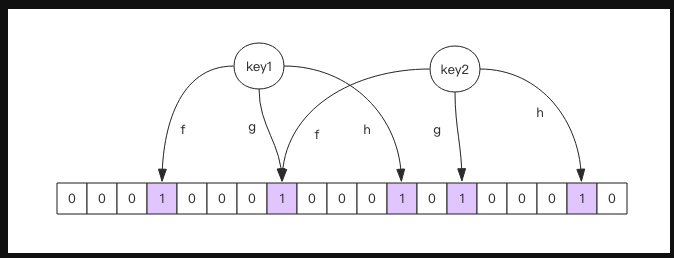

# 布隆过滤器

- 去重的同时能节省空间
- 节省数据库的IO请求
- 节省缓存

​    实际上，如果历史记录存储在关系数据库里，去重就需要频繁地对数据库进行 exists 查询，当系统并发量很高时，数据库是很难扛住压力的。

​    你可能又想到了缓存，但是如此多的历史记录全部缓存起来，那得浪费多大存储空间啊？而且这个存储空间是随着时间线性增长，你撑得住一个月，你能撑得住几年么？但是不缓存的话，性能又跟不上，这该怎么办？

​    这时，布隆过滤器 (Bloom Filter) 闪亮登场了，它就是专门用来解决这种去重问题的。它在起到去重的同时，在空间上还能节省 90% 以上，只是稍微有那么点不精确，也就是有一定的误判概率。

## 布隆过滤器是什么

- 添加过的肯定存在
- 查询某个之存在时 这个值不一定存在
- 会有误判
- 通过参数设置 可以控制精度

 布隆过滤器可以理解为一个不怎么精确的 set 结构，当你使用它的 contains 方法判断某个对象是否存在时，它可能会误判。但是布隆过滤器也不是特别不精确，只要参数设置的合理，它的精确度可以控制的相对足够精确，只会有小小的误判概率。

​    当布隆过滤器说某个值存在时，这个值可能不存在；当它说不存在时，那就肯定不存在。打个比方，当它说不认识你时，肯定就不认识；当它说见过你时，可能根本就没见过面，不过因为你的脸跟它认识的人中某脸比较相似 (某些熟脸的系数组合)，所以误判以前见过你。

​    套在上面的使用场景中，布隆过滤器能准确过滤掉那些已经看过的内容，那些没有看过的新内容，它也会过滤掉极小一部分 (误判)，但是绝大多数新内容它都能准确识别。这样就可以完全保证推荐给用户的内容都是无重复的。

## Redis 中的布隆过滤器

- Redis 4.0中作为插件添加、

Redis 官方提供的布隆过滤器到了 Redis 4.0 提供了插件功能之后才正式登场。布隆过滤器作为一个插件加载到 Redis Server 中，给 Redis 提供了强大的布隆去重功能

在Docker中使用

```shell
docker pull redislabs/rebloom
docker run --name=redisbloom -d  -p6381:6379 redislabs/rebloom
redis-cli -p 6381
```

`bf.add` 添加元素，`bf.exists` 查询元素是否存在

`bf.add` 只能一次添加一个元素，如果想要一次添加多个，就需要用到 `bf.madd` 指令。同样如果需要一次查询多个元素是否存在，就需要用到 `bf.mexists` 指令

```
127.0.0.1:6381> bf.add code user1
(integer) 1
127.0.0.1:6381> bf.add code user2
(integer) 1
127.0.0.1:6381> type code
MBbloom--
127.0.0.1:6381> bf.add code user3
(integer) 1
127.0.0.1:6381> bf.exists code user1
(integer) 1
127.0.0.1:6381> bf.exists code user5
(integer) 0
127.0.0.1:6381> bf.madd code user7 user8 user9
1) (integer) 1
2) (integer) 1
3) (integer) 1
127.0.0.1:6381> bf.mexists code user7 user9 user10
1) (integer) 1
2) (integer) 1
3) (integer) 0
127.0.0.1:6381>
```

原因就在于布隆过滤器对于已经见过的元素肯定不会误判，它只会误判那些没见过的元素

### 测量误判率

我们先随机出一堆字符串，然后切分为 2 组，将其中一组塞入布隆过滤器，然后再判断另外一组的字符串存在与否，取误判的个数和字符串总量一半的百分比作为误判率。

```
"""
使用bf.reserve 设置错误率
不使用 bf.reserve，默认的error_rate是 0.01，默认的initial_size是 100。
"""
r.execute_command("bf.reserve", "code", 0.001, 50000)
```

##  注意事项

​    布隆过滤器的`initial_size`估计的过大，会浪费存储空间，估计的过小，就会影响准确率，用户在使用之前一定要尽可能地精确估计好元素数量，还需要加上一定的冗余空间以避免实际元素可能会意外高出估计值很多。

​    布隆过滤器的`error_rate`越小，需要的存储空间就越大，对于不需要过于精确的场合，`error_rate`设置稍大一点也无伤大雅。比如在新闻去重上而言，误判率高一点只会让小部分文章不能让合适的人看到，文章的整体阅读量不会因为这点误判率就带来巨大的改变。

## 布隆过滤器的原理



###  add原理

- 向布隆过滤器中添加key,多个hash函数会对key进行计算得到一个一个整数索引值，然后对位数组长度取模计算得到一个位置，每个hash函数都会得到一个位置
- 把数组的这几个位置都置1，完成add操作，


### 查询原理

- 布隆过滤器查询key是否存在和add原理一样，同样会把hash的位置计算出来， 查看数组中的位置是否都是1
- 有一个位置是0，则该key不存在
- 如果都是1，说明该key极有可能存在


使用的是时候不要让实际的元素大于初始化的大小，当实际元素超过布隆过滤器的大小的时候，需要重建，重新分配一个size更大的布隆过滤器，再将所有的历史记录批量add(需要在其他存储器中存储历史元素)

Errata不会因为元素超过限制就极具增加，增加了重建的时间


## 空间占用估计

两个输入参数:

- 元素数量n
- 错误率f

两个输出：
- 数组长度l 需要的存储空间bit
- Hash 函数的最佳数量k,影响错误率

```
k=0.7*(l/n)# 约等于

f=0.6185^(l/n) # ^ 表示次方计算，也就是 math.pow
```

结论：

- 数组位数越长，错误率越低

- 数组位数越长，hash函数数量越多，影响计算效率

- 当一个元素平均需要 1 个字节 (8bit) 的指纹空间时 (l/n=8)，错误率大约为 2%

- 错误率为 10%，一个元素需要的平均指纹空间为 4.792 个 bit，大约为 5bit

- 错误率为 1%，一个元素需要的平均指纹空间为 9.585 个 bit，大约为 10bit

- 错误率为 0.1%，一个元素需要的平均指纹空间为 14.377 个 bit，大约为 15bit

布隆过滤器存储的是指纹空间，最多占用2个字节，相对set节省空间

布隆计算器<https://krisives.github.io/bloom-calculator/>


## 无法用Redsi4.0

pyrebloom 库就不支持重 连和重试，在使用时需要对它做一层封装后才能在生产环境中使用

[Python Redis Bloom Filter](https://github.com/robinhoodmarkets/pyreBloom)


## 布隆过滤器的其它应用

- 爬虫URL的去重复，URL太多了，使用集合会浪费很多的空间，会大幅降低存储消耗，仅仅错过少量的页面
- NoSQL中HBase、Cassandra 还有 LevelDB、RocksDB 内部都有布隆过滤器结构，
- 布隆过滤器能显著降低数据库的IO请求，当用户查询某个row时，先通过布隆过滤器过滤掉大量不存在的请求，然后再去磁盘查询
- 邮件系统的垃圾邮件过滤功能也普遍使用了布隆过滤器